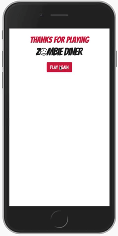

# Zombie Diner

Zombie Diner was created for Flatiron School's 2019 Gam Jam and won "Funniest Game".

# How To Play
Zombies are hungry, clear all the food orders by adding the right ingredients to the plate before serving them.

Can you clear all the orders before the time runs out?

Demo - https://zombie-diner.herokuapp.com

# Team
- [Jacob](https://www.github.com/jacolam)
- [Will](https://www.github.com/willsinn)
- [Edgar](https://www.github.com/eddgr)
- [Troy](https://www.github.com/gamerman2001)

# Tech Stack
- React
- Ruby on Rails
- Bootstrap

# Credits
All icons in the game came from [The Noun Project](https://www.thenounproject.com).

We used icons from the following artists:

IconMark, Leszek Pietrzak, Vectorstall, ST, mungang kim, NAMI A, David Ly, retinaicon, Victoruler, Vectors Market, BomSymbols, Audrey, Sridharan S, hafiudin, Alex Muravev
